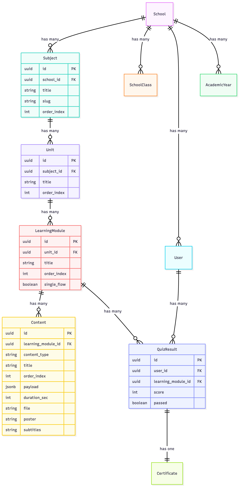

# Architektura: Moduły Edukacyjne

Powiązane dokumenty:

- start dokumentacji: [`docs/README.md`](README.md)
- flow użytkowników: [`docs/flow_uzytkownikow.md`](flow_uzytkownikow.md)
- API/Swagger: [`docs/api.md`](api.md)

## Hierarchia Modeli

Struktura treści edukacyjnych następuje hierarchicznemu modelowi:

```
Subject (Przedmiot)
  └── Unit (Jednostka)
      └── LearningModule (Moduł edukacyjny)
          └── Content (Materiał)
```

### Obecna Implementacja (7 Modułów)

Obecnie system implementuje 7 globalnych modułów edukacyjnych (przedmiotów), które są dostępne dla wszystkich szkół:

1. **Polska i świat** - Historia i wiedza o społeczeństwie
2. **Bezpieczeństwo** - Bezpieczeństwo i ochrona
3. **Ekologia** - Ekologia i środowisko
4. **Zdrowie** - Zdrowie i dobre samopoczucie
5. **Kultura** - Kultura i sztuka
6. **Technologia** - Technologia i umiejętności cyfrowe
7. **Przedsiębiorczość** - Przedsiębiorczość

Każdy przedmiot ma:
- Jedną Jednostkę (ponieważ każdy przedmiot = jedna jednostka w obecnej strukturze)
- Jeden Moduł edukacyjny (ponieważ każda jednostka = jeden moduł)
- Wiele Contents (wideo, infografiki, quizy, PDFy, itp.)

### Wizja Przyszłości: Pełny Rejestr Szkolny

Wizja przyszłości rozszerza tę strukturę, aby wspierać pełny system rejestru szkolnego:

```
Subject (Przedmiot) - np. "Matematyka", "Język polski"
  └── Unit (Jednostka) - np. "Algebra", "Gramatyka"
      └── LearningModule (Moduł edukacyjny) - np. "Równania liniowe", "Odmięnianie czasowników"
          └── Content (Materiał) - Wideo, Infografiki, Quizy, PDFy, Webinary, Aktywa
```

**Kluczowe różnice:**
- Przedmioty będą specyficzne dla szkoły (obecnie globalne)
- Wiele Jednostek na Przedmiot
- Wiele Modułów edukacyjnych na Jednostkę
- Bogata biblioteka Contents z różnymi typami

## Typy Treści

### Video
- `youtube_url`: Link do wideo YouTube
- `duration_sec`: Czas trwania wideo w sekundach
- `file`: Opcjonalny wgrany plik wideo (alternatywa dla YouTube)
- `poster`: Miniaturka/obraz postera
- `subtitles`: Plik napisów (.srt, .vtt)
- `payload`: `{ "subtitles_lang": "pl" }` - Kod języka dla napisów

### Infografika
- `file`: Plik obrazu (SVG, PNG, PDF)
- Wyświetlana jako treść wizualna

### Quiz
- `payload`: Struktura JSON z pytaniami, opcjami, poprawnymi odpowiedziami, punktami, progiem zdania
- Przykładowa struktura:
```json
{
  "questions": [
    {
      "id": "q1",
      "type": "single",
      "text": "Tekst pytania?",
      "options": [
        { "id": "a", "text": "Opcja A" },
        { "id": "b", "text": "Opcja B" }
      ],
      "correct": ["a"],
      "points": 1
    }
  ],
  "pass_threshold": 80
}
```

### PDF
- `file`: Plik dokumentu PDF
- Do pobrania dokumentów

### Webinar
- `youtube_url`: Link do wideo webinaru
- `duration_sec`: Czas trwania w sekundach
- Podobne do Video, ale kategoryzowane osobno

### Asset
- `file`: Dowolny typ pliku
- Ogólne wgrywanie pliku dla różnych zasobów

## Relacje w Bazie Danych

Diagram relacji encji (PNG): [`docs/relations.png`](relations.png)



### Subject (Przedmiot)
- `belongs_to :school` (opcjonalne - `nil` = przedmiot globalny)
- `has_many :units`
- Pola: `title`, `slug`, `order_index`, `icon` (CarrierWave), `color_light`, `color_dark`

### Unit (Jednostka)
- `belongs_to :subject`
- `has_many :learning_modules`
- Pola: `title`, `order_index`

### LearningModule (Moduł edukacyjny)
- `belongs_to :unit`
- `has_many :contents`
- `has_many :quiz_results` (do śledzenia ukończeń quizów)
- Pola: `title`, `order_index`, `published` (boolean), `single_flow` (boolean)

**`single_flow: true`** = Sztywna sekwencja
- Użytkownik **musi** przejść przez wszystkie Contents w **ustalonej kolejności**
- Nie można pominąć żadnego materiału
- Nie można zmienić kolejności
- Przykład: Video (1) → Infografika (2) → Quiz (3) - obowiązkowo wszystkie, w tej kolejności

**`single_flow: false`** = Dowolny wybór
- Użytkownik widzi **listę wszystkich Contents** w module
- Może wybrać **dowolną liczbę** Contents (np. tylko video, lub video + quiz, lub wszystkie)
- Może wybierać Contents w **dowolnej kolejności** (np. quiz przed infografiką, lub tylko infografika)
- Może wybrać **które konkretne Contents** chce zobaczyć (nie jest zmuszony do obejrzenia wszystkich)
- Contents są wyświetlane jako lista do wyboru, nie jako wymuszona sekwencja
- Przykład: Moduł ma Video, Infografikę, Quiz, PDF - użytkownik może wybrać tylko Video i Quiz, w dowolnej kolejności

### Content (Materiał)
- `belongs_to :learning_module`
- Pola: `title`, `content_type` (video/infographic/quiz/pdf/webinar/asset), `order_index`, `duration_sec`, `youtube_url`, `payload` (JSONB), `file`, `poster`, `subtitles`
- `order_index` określa kolejność wyświetlania w module (używane przy `single_flow: false` do sortowania listy)

### QuizResult (Wynik quizu)
- `belongs_to :user` (uczeń)
- `belongs_to :learning_module`
- Pola: `score`, `passed`, `answers` (JSONB), `completed_at`

### Certificate (Certyfikat)
- `belongs_to :user` (uczeń)
- `belongs_to :learning_module`
- Generowany gdy uczeń ukończy moduł edukacyjny (wszystkie wybrane Contents obejrzane, quiz zdany)

## Struktura API

### Subjects (Przedmioty)
- `GET /api/v1/subjects` - Lista wszystkich przedmiotów (prosty lista, bez pełnej struktury)
- `GET /api/v1/subjects/:id` - Pokaż przedmiot z pełną strukturą (jednostka → moduł edukacyjny → materiały)
- `GET /api/v1/subjects/with_contents` - Wszystkie przedmioty z pełną strukturą (dla trybu offline)

### Units (Jednostki)
- `GET /api/v1/units` - Lista jednostek (filtrowanie po `subject_id`)
- `GET /api/v1/units/:id` - Pokaż szczegóły jednostki

### Learning Modules (Moduły edukacyjne)
- `GET /api/v1/learning_modules` - Lista tylko opublikowanych modułów
- `GET /api/v1/learning_modules/:id` - Pokaż szczegóły modułu (tylko opublikowane, chyba że admin)
- Moduły zwracają `single_flow` flag, która określa czy Contents są w sztywnej sekwencji czy do dowolnego wyboru

### Contents (Materiały)
- `GET /api/v1/contents` - Lista materiałów (filtrowanie po `learning_module_id`)
- `GET /api/v1/contents/:id` - Pokaż szczegóły materiału (tylko z opublikowanych modułów, chyba że admin)
- Przy `single_flow: false` - Contents są zwracane jako lista posortowana po `order_index`, użytkownik wybiera które chce zobaczyć

## Panel Administracyjny

Wszystkie zasoby (Subjects, Units, Learning Modules, Contents) są zarządzane przez panel superadministratora na `/admin`:

- **Subjects**: `/admin/subjects` - Zarządzanie globalnymi przedmiotami
- **Units**: `/admin/units` - Zarządzanie jednostkami
- **Learning Modules**: `/admin/learning_modules` - Zarządzanie modułami z przeciąganiem i upuszczaniem Contents do zmiany kolejności (gdy `single_flow: false`)
  - W widoku edycji modułu: gdy `single_flow: false`, Contents można zmieniać kolejność przez drag-and-drop
  - Kolejność jest zapisywana w `order_index` każdego Content
- **Contents**: `/admin/contents` - Zarządzanie materiałami z dynamicznymi formularzami w zależności od typu treści

## Przepływ Użytkownika

1. Uczeń wybiera Przedmiot
2. Uczeń widzi Jednostkę (obecnie 1:1 z Przedmiotem)
3. Uczeń widzi Moduł edukacyjny (obecnie 1:1 z Jednostką)
4. **Jeśli `single_flow: true`**: Uczeń **musi** przejść przez Contents w **ustalonej kolejności** (Video → Infografika → Quiz). Nie można pominąć, nie można zmienić kolejności, wszystkie Contents muszą być ukończone sekwencyjnie.
5. **Jeśli `single_flow: false`**: Uczeń widzi **listę wszystkich Contents** i może:
   - Wybrać **dowolną liczbę** Contents (np. tylko wideo, lub wideo + quiz, lub wszystkie)
   - Wybrać Contents w **dowolnej kolejności** (np. quiz przed infografiką, lub tylko infografika)
   - Wybrać **które konkretne Contents** chce zobaczyć (nie jest zmuszony do obejrzenia wszystkich)
   - Contents są wyświetlane jako lista do wyboru, nie jako wymuszona sekwencja
6. Po ukończeniu wybranych Contents i zdaniu Quizu (jeśli quiz jest włączony), uczeń otrzymuje Certyfikat

## Obecne vs Przyszłe

### Obecne (7 Modułów)
- 7 globalnych przedmiotów
- Każdy przedmiot = 1 jednostka = 1 moduł edukacyjny
- Prosta struktura dla początkowej implementacji
- Fokus na 7 głównych tematach
- Każdy moduł może mieć `single_flow: true` (sztywna sekwencja) lub `single_flow: false` (dowolny wybór)

### Przyszłe (Pełny Rejestr Szkolny)
- Przedmioty specyficzne dla szkoły
- Wiele jednostek na przedmiot
- Wiele modułów edukacyjnych na jednostkę
- Bogata biblioteka treści
- Biblioteka materiałów (treści wielokrotnego użytku między modułami)
- Pełne zarządzanie programem nauczania
- Moduły nadal będą wspierać `single_flow: true/false` dla elastyczności w prezentacji treści
