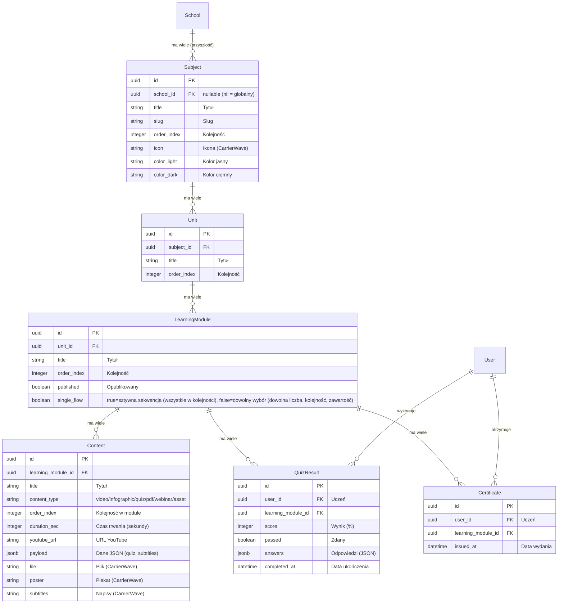
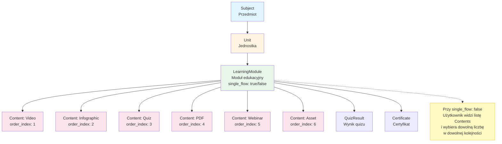
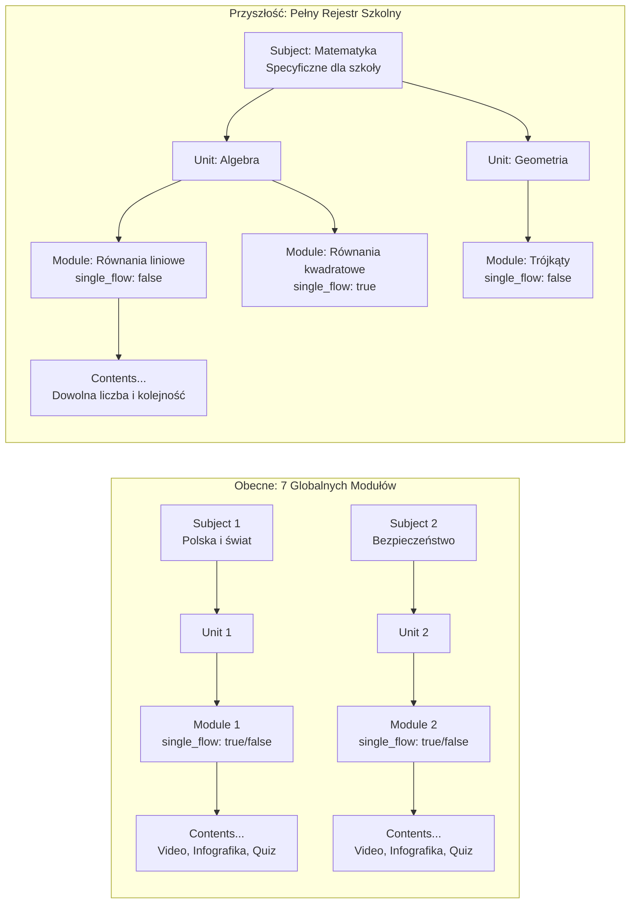
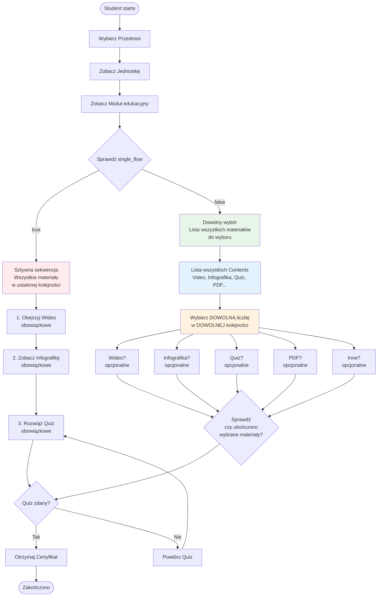
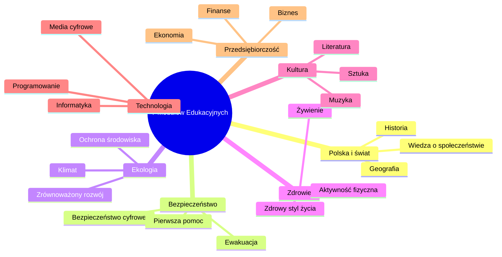
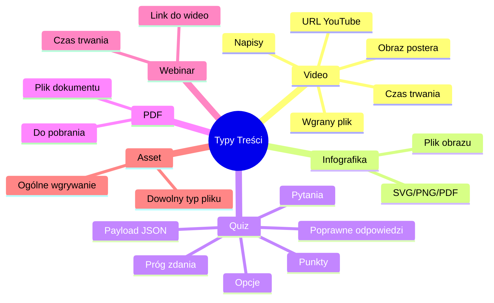
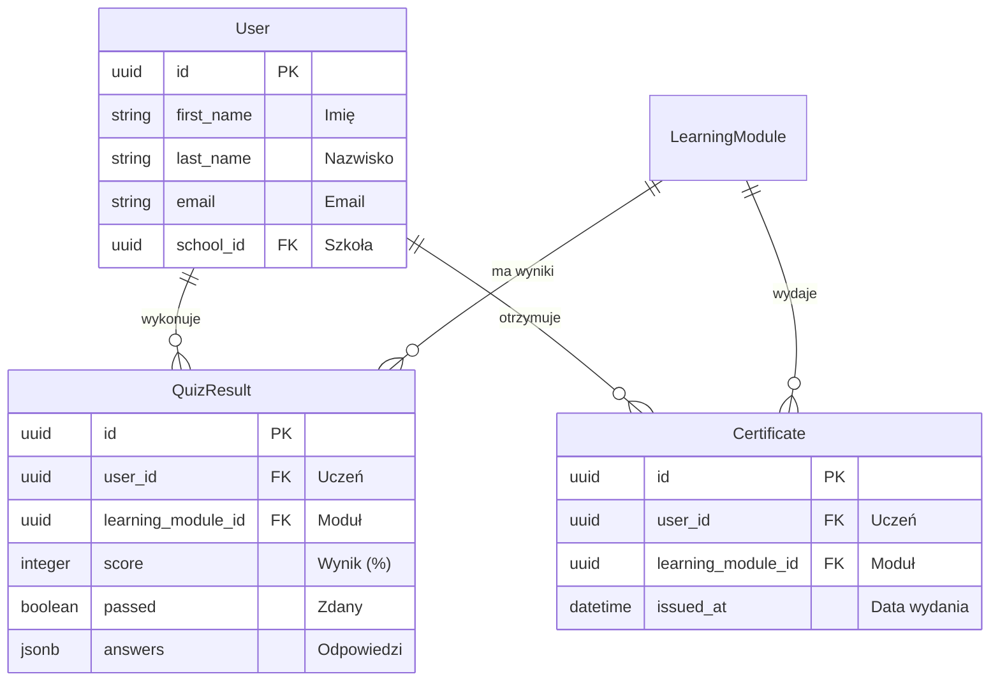

# Learning Modules - Diagrams

## ERD (Diagram Związków Encji)

## Hierarchia Struktury Danych

## Current vs Future Module Structure

## User Flow

## Mapowanie: 7 Tematów → Przedmioty Szkolne

## Mapa Typów Treści

## Relacje Użytkownik / Wyniki

